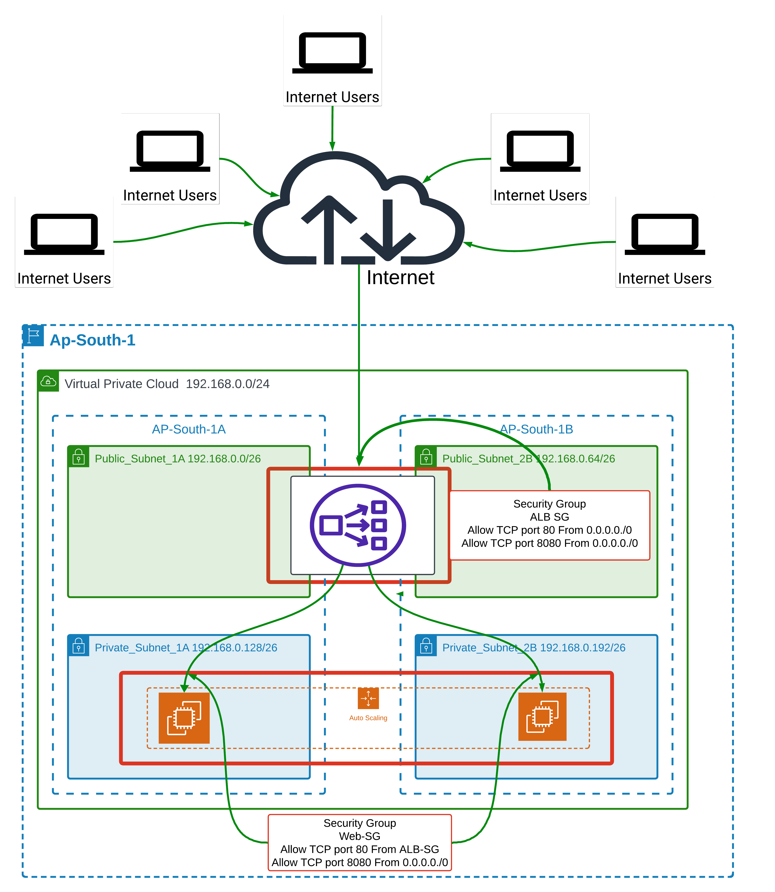
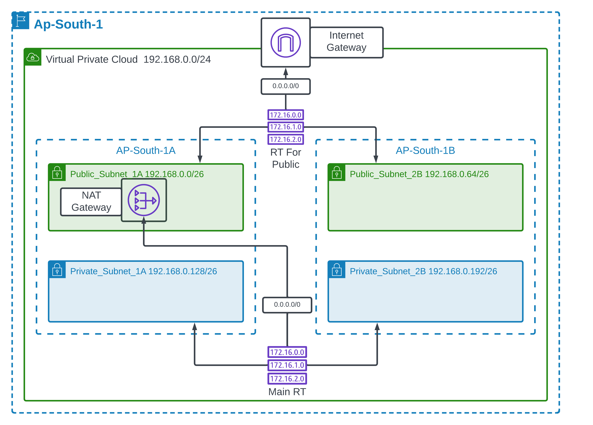

# Aws-Resilient-web-App
A comprehensive AWS capstone project showcasing a resilient, highly available, and auto-scaling web application infrastructure with secure multi-AZ networking.


# Resilient and Scalable Web Application Deployment on AWS

## 📝 Project Overview
This project demonstrates the design and implementation of a highly available, fault-tolerant, and scalable web application infrastructure on AWS. The architecture is engineered to handle varying traffic loads efficiently while maintaining minimal downtime across multiple Availability Zones, ensuring secure user access and resilience.

**Note on Scope:** This is an infrastructure-focused portfolio project designed to demonstrate advanced cloud architecture, secure multi-AZ networking, decoupled storage integration, and automated system initialization. The application layer utilizes a lightweight placeholder deployment to validate successful end-to-end web routing, load balancing metrics, and self-healing behaviors.

---

## 🏗️ Architecture Diagrams

The structural implementation and network segregation models used in this deployment are outlined below:

### 1. High Availability & Application Tier Infrastructure


### 2. Isolated Network & Routing Infrastructure


---

## 🎯 Project Objectives
* **Zero Single Points of Failure:** Distributed infrastructure across multiple Availability Zones (AZs).
* **Automatic Healing & Scale-Out:** Automated recovery and capacity provisioning when instances drop out or traffic peaks.
* **Decoupled Configuration:** Application content resides on a shared storage array independent of individual instance lifecycles.
* **Boundary Security:** Private subnetting ensures backend application layers remain entirely hidden from direct internet vectors.

---

## 🌐 Network Subnetting & IP Allocations

Built inside the `ap-south-1` region with a base network block of `192.168.0.0/24`:

| Subnet Name | Availability Zone | CIDR Block | Type |
| :--- | :--- | :--- | :--- |
| **Public_Subnet_1A** | ap-south-1a | `192.168.0.0/26` | Public (ALB Facing) |
| **Public_Subnet_2B** | ap-south-1b | `192.168.0.64/26` | Public (ALB Facing) |
| **Private_Subnet_1A** | ap-south-1a | `192.168.0.128/26` | Private (App Tier) |
| **Private_Subnet_2B** | ap-south-1b | `192.168.0.192/26` | Private (App Tier) |

---

## 🔒 Security Group Formations

### 1. Load Balancer Security Group (`ALB-SG`)
* **Inbound Rules:**
  * Allow `HTTP` (`TCP 80`) from `0.0.0.0/0`
  * Allow `Custom Alternative Web` (`TCP 8080`) from `0.0.0.0/0`

### 2. Web Instance Security Group (`Web-SG`)
* **Inbound Rules:**
  * Allow `HTTP` (`TCP 80`) strictly restricted to the source `ALB-SG`.
  * Allow `Custom App Port` (`TCP 8080`) from `0.0.0.0/0`.

### 3. Storage Security Group (`EFS-SG`)
* **Inbound Rules:**
  * Allow `NFS` (`TCP 2049`) strictly restricted to the source `Web-SG`.

---

## 🛠️ Step-by-Step Implementation Guide

### Step 1: Create the Isolated Networking Infrastructure (VPC)
* **Action:** Defined a custom VPC with the network CIDR block `192.168.0.0/24`.
* **Action:** Symmetrically provisioned public and private subnets across two separate Availability Zones (`ap-south-1a` and `ap-south-1b`) for enhanced multi-zone durability.
* **Action:** Attached an Internet Gateway (IGW) to manage outbound/inbound public internet traffic routing.
* **Action:** Deployed a NAT Gateway inside the public subnet (`Public_Subnet_1A`) to provide isolated private computing instances secure internet outreach for packages and system configurations without exposing them to incoming public vectors.

### Step 2: Establish the Shared Storage Layer (Amazon EFS)
* **Action:** Created an Elastic File System (EFS) instance to hold centralized application assets.
* **Action:** Configured explicit mount targets across `Private_Subnet_1A` and `Private_Subnet_2B`.
* **Action:** Wrapped the file system inside a secure EFS Security Group that strictly accepts incoming connections exclusively over `NFS Port 2049` originating from matching application cluster security targets.

### Step 3: Build and Configure the Baseline EC2 Instance
* **Action:** Launched a baseline configuration EC2 node to act as the primary blueprint setup stage.
* **Action:** Connected to the terminal console and initialized web engine services alongside the necessary file mount utilities by executing the following terminal operations:

```bash
# Update system packages and install Apache Web Server & EFS utilities
sudo yum update -y
sudo yum install -y httpd amazon-efs-utils

# Create the standard web root deployment directory
sudo mkdir -p /var/www/html

# Mount the remote EFS file system to your web root folder
# (Replace 'fs-xxxxxxxxxxxxxxxxx' with your actual AWS EFS File System ID)
sudo mount -t efs -o tls fs-xxxxxxxxxxxxxxxxx:/ /var/www/html

# Write the file systems table instruction to ensure permanent mount stability
echo "fs-xxxxxxxxxxxxxxxxx:/ /var/www/html efs defaults,_netdev,tls 0 0" | sudo tee -a /etc/fstab

# Create a clean default placeholder index landing page directly inside your shared EFS mount point
sudo bash -c 'cat <<EOF > /var/www/html/index.html
<!DOCTYPE html>
<html>
<head>
    <title>AWS Capstone Web Application</title>
    <style>
        body { font-family: Arial, sans-serif; text-align: center; margin-top: 50px; background-color: #f4f6f9; }
        .container { background: white; padding: 30px; border-radius: 10px; box-shadow: 0px 4px 10px rgba(0,0,0,0.1); display: inline-block; }
        h1 { color: #ff9900; }
    </style>
</head>
<body>
    <div class="container">
        <h1>Resilient & Scalable Web Application Infrastructure</h1>
        <p>Status: <strong style="color: green;">Online & Highly Available</strong></p>
        <p>Deployment Type: AWS Auto Scaling Group backed via Custom Golden AMI & Amazon EFS</p>
    </div>
</body>
</html>
EOF'

# Configure the Apache Web Service to automatically start up whenever the system boots
sudo systemctl enable httpd

# Start the web engine services
sudo systemctl start httpd
```
Step 4: Baking the Custom Machine Image (AMI)
Action: Stopped the baseline server node to protect transaction volumes and structural consistency.
Action: Triggered the Create Image (AMI) task to build a custom snapshot blueprint named Golden-Web-Image-v1. This stores the pre-built Linux variables, boot environment paths, file tables (/etc/fstab), and automated service startup actions directly into a reusable machine template.

Step 5: Provision High Availability via ALB and Auto Scaling (ASG)
Action: Created an Application Load Balancer (ALB) mapping incoming internet client connection blocks directly through your public subnet groups (Public_Subnet_1A and Public_Subnet_2B).
Action: Designed an Auto Scaling Launch Template using your custom-baked Golden-Web-Image-v1 AMI.
Action: Placed the automated deployment scripts directly into the User Data execution field to guarantee that any new infrastructure node auto-created by scaling events mounts the shared asset storage automatically upon system initialization:

```bash

#!/bin/bash
# System automation script to execute upon ASG Scale-Out/Instance Replacement
yum update -y
yum install -y httpd amazon-efs-utils

# Re-establish web directories
mkdir -p /var/www/html

# Mount the central persistent asset pool
mount -t efs -o tls fs-xxxxxxxxxxxxxxxxx:/ /var/www/html
echo "fs-xxxxxxxxxxxxxxxxx:/ /var/www/html efs defaults,_netdev,tls 0 0" >> /etc/fstab

# Kickstart and ensure persistence for the web server daemon
systemctl enable httpd
systemctl start httpd

```
Action: Deployed the Auto Scaling Group (ASG) across Private_Subnet_1A and Private_Subnet_2B to scale nodes symmetrically across distinct availability zones.

Step 6: Map Custom Domain via Route 53
Action: Directed custom application names and system addresses cleanly to the native fully qualified domain name (FQDN) endpoint of the target Application Load Balancer via Amazon Route 53. 

Step 7: Configure SNS Alerting & Monitoring
Action: Created an Amazon Simple Notification Service (SNS) Topic designated for infrastructure alerts.
Action: Subscribed an administrative email address to the SNS topic to receive real-time notifications.
Action: Configured a CloudWatch Alarm tied to the Auto Scaling Group that monitors overall CPU Utilization. The alarm is set to trigger and publish a message to the SNS topic if CPU usage exceeds the 80% threshold.

🔬 Testing, Persistence, & Validation Procedures
1. Simulating Server Termination (Self-Healing)
To validate true disaster resilience, manually terminate an active EC2 application instance from the management console. The Auto Scaling Group will immediately mark the target path as unhealthy, schedule an automated infrastructure replacement cycle, spin up a clean node using your Golden-Web-Image-v1 machine image, run the user data initialization scripts to remount the centralized EFS volume, and return the cluster environment to total health without any impact to user accessibility.

3. Auto Scaling Stress Test & SNS Alert Verification
To confirm that dynamic scaling and alerting mechanisms function as intended:

3(a). Connected to an active backend EC2 instance and executed a load generation test application using the stress utility to intentionally force the instance's CPU utilization above the 80% limit.

3(b). Alert Verification: Once the 80% threshold was breached, CloudWatch triggered the alarm, successfully dispatching a warning email via the configured SNS topic.

3(c). Scale-Out Verification: The ASG recognized the sustained CPU load and automatically provisioned new EC2 instances to distribute the traffic and balance the workload.

3(d). Scale-In Verification: Upon stopping the stress test application, the CPU utilization dropped back to standard levels, prompting the ASG to safely terminate the temporary instances and scale the environment back down to its baseline state.


